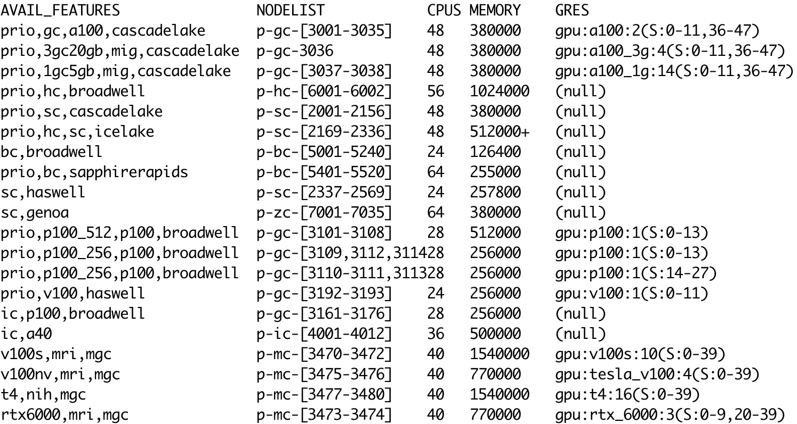

# Compute hardware

A cluster consists of multiple nodes.
A node is basically a single computer, 
roughly comparable to a powerful desktop machine.
Some nodes are networked together with fast connections (Infiniband)
that enable large jobs to run in parallel on multiple nodes.
Finally, some nodes include GPUs (graphical processing units),
which can accelerate certain compute jobs.

Compute nodes in a cluster 
are connected to a set of "submit nodes"
where users login and submit compute jobs,
and also to a central filesystem that stores files.


## Partitions

Nodes on Collab are grouped into seven different *partitions*:

- **vintage** – Older hardware, accessible at no cost via the open queue.
- **basic** – CPU nodes without Infiniband, for jobs that fit on a single node.
- **standard** – CPU nodes with Infiniband (essential for multinode jobs).
- **high-memory** – CPU nodes with extra memory, for memory-intensive jobs.
- **GPU** – Standard nodes, with one or more powerful GPUs.
- **GPU 2** – Older CPU nodes, with one older GPU.
- **interactive** – Nodes with graphics cards, that service the Portal.

Each node type consists of different hardware, 
appropriate to its purpose:

| Partition | Cores | Memory (GB) | CPU | GPU | Network | Count |
| ---- | ---- | ---- | ---- | ---- | ---- | ---- |
| Vintage | 24 | 128 | E5-2650v4 | | ethernet | 240 |
| Basic | 64 | 256 | Gold 6430 | | ethernet | 120 |
| Standard | 64 <br> 48 <br> 48 | 384 <br> 384 <br> 512 | EPYC 9354 <br> Gold 6248R <br> Gold 6342 | | Infiniband | 36 <br> 168 <br> 160 |
| Hi-memory | 48 <br> 28 | 1024 <br> 1024 | Gold 6342 <br> E7-4830v4 | | ethernet | 8 <br> 2 |
| GPU | 48 <br> 24 <br> 24 | 384 <br> 768 <br> 512 | Gold 6248R <br> Gold 6132 <br> E5-2680v3 | dual A100 <br> quad V100 <br> V100 | Infiniband | 38 <br> 2 <br> 2 |
| GPU2 | 28 <br> 28 | 256 <br> 512 | E5-2680v4 <br> E5-2680v4 | P100 <br> P100 | Infiniband | 76 <br> 8 |
| Interactive | 36 | 512 | Gold 6354 | A40 | ethernet | 12 |

For Roar Restricted hardware, see [Roar Restricted](16_RoarRestricted.md).

## Node attributes

Not all hardware on Roar Collab is identical,
even within the different partitions.
Sometimes, software compiled for one type of CPU or GPU
will not run on another type of CPU or GPU.  
To find out specifics about the hardware on different nodes,
there are several options.

If you are logged onto a compute node with `salloc`, the command `lscpu`
displays information about the CPU and its capabilities;
`nvidia-smi` displays information 
about the GPU (if present).

## sinfo

The SLURM command `sinfo` displays information about *all* Collab nodes.
Its output is more easily read with some formatting options,
```
sinfo --Format=features:30,nodelist:20,cpus:5,memory:10,gres:30
```
which generates a table like this:



Evidently, node attributes serve many functions, 
serving to identify nodes with a given

- CPU type (broadwell, haswell, ...)
- GPU type (a100, g100)
- partition (bc, sc, hc, gc, ic,...)
- specific hardware combinations (p100_256, 3gc20gb, ...)

## Constraints

Mostly, partitions are "uniform enough"
to specify hardware for most batch jobs.  
If you do need request nodes with a given feature,
add a line to your batch script:
```
#SBATCH --constraint=<feature>
```
where `<feature>` is one of the features listed by sinfo
(or multiple features, separated by commas).

To request nodes with a given feature for an interactive job,  
add a `-C` option to your `salloc` command:
```
salloc -N 1 -n 4 -A <alloc> -C <feature> -t 1:00:00
```
