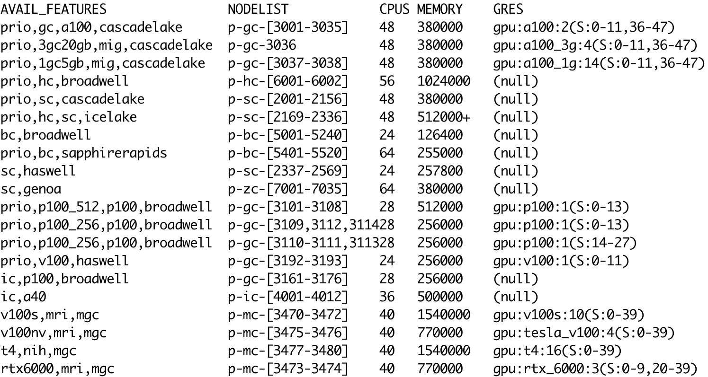

# Node attributes

Not all hardware on Roar Collab is identical,
even within the different partitions (vintage, basic, standard, hi-memory, GPU, GPU2).
Sometimes, software compiled for one kind of CPU or GPU will not run on another,
typically older, CPU or GPU.

For example, vintage nodes have an older version of SIMD 
(single instruction multiple data),
AVX2_256, than do the newer basic and standard nodes, AVX_512.
Software compiled assuming AVX_512 will not run on vintage nodes.

To find out specifics about the hardware on different nodes,
there are several options.

If you are logged onto a compute node with `salloc`, the command `lscpu`
will display information about the CPU and its capabilities.
Likewise, if you are logged onto a GPU node, the command `nvidia-smi`
will display information about the GPU and its capabilities.

From any node including submit nodes,
the SLURM command `sinfo` displays information about *all* Collab nodes.
`sinfo` output is more easily read with some formatting options,
```
sinfo --Format=features:30,nodelist:20,cpus:5,memory:10,gres:30
```
which generates a table like this:



To request nodes with a given feature, add a line to your batch script:
```
#SBATCH --constraint=<feature>
```
where <feature> is one of the features listed by `sinfo`
(or multiple features, separated by commas).

Likewise, to request nodes with a given feature for an interactive job,
add a `-C` option to your `salloc` command:
```
salloc -N 1 -n 4 -A <alloc> -C <feature> -t 1:00:00
```