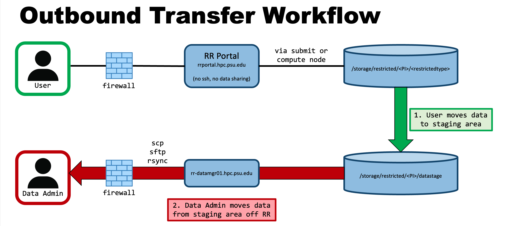
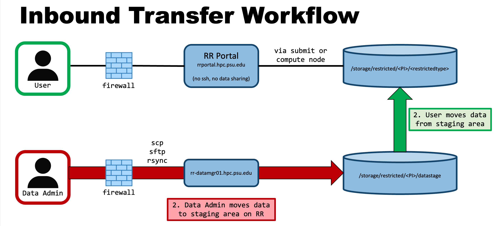

# Roar Restricted

Roar Restricted (RR) is intended for working with restricted data.
Group storage on RR is provided on an as-needed basis 
to principal investigators (PIs) who work with restricted data,
and must comply with more stringent data storage standards.

Most material in the User Guide 
applies to both Roar Collab (RC) and RR.
This addendum addresses items unique to RR.

## Compute hardware

Roar Restricted consists of two different partitions:

| Resource | Cores | Memory (GB) | CPU | GPU | Network | Count |
| ---- | ---- | ---- | ---- | ---- | ---- | ---- |
| Standard | 48   24 | 384   256 | Gold 6248R   E5-2680v3 | | Infiniband | 12   48 |
| GPU | 28 | 256 | E5-2680v4 | quad P100 | Infiniband | 3 |

## Accessing

To request an account on RR, a user must complete the 
[Account Request](https://accounts.aci.ics.psu.edu) form, 
and email <icds@psu.edu> to request a RR account.
The email should include the user's access ID, 
and the restricted storage owner's name and access ID.
Non-faculty accounts require approval from a PI sponsor. 

Before accessing RR, the user must complete the RR training module
via [Penn State LRN](https://lrn.psu.edu).
This training is required by the Office of Information Security (OIS) 
to maintain compliance with the Authority to Operate (ATO).

## Connecting

RR does not offer an open queue;
users must have a paid allocation.

Users can connect to RR only via the RR Portal (<https://rrportal.hpc.psu.edu>).
The RR Portal can only be accessed from the Penn State network 
or the Penn State GlobalProtect VPN. 
GlobalProtect software can be downloaded [here](https://www.it.psu.edu/software/);
Penn State IT provides configuration instructions [here][GPconfig].
[GPconfig]: https://pennstate.service-now.com/sp?id=kb_article_view&sysparm_article=KB0013431&sys_kb_id=24f7cdd9dbd7e0d02c4f9e74f3961967&spa=1 

## Handling data 

To limit the risk of data leaks
and comply with restricted data storage standards,
ICDS has implemented a Secure Data Transfer Management Model:
transfer of data to and from RR 
can only be performed via a data manager node,
to which access is limited.

RR users can move data between their group storage 
and the group's staging area on the data manager node;
but only approved data administrators can move data
between the staging area and the outside world
(see diagrams below).

PIs can request approval to perform such data transfers,
or nominate data administrators from their group.
To request data administrator access,
a user must email <icds@psu.edu>, copying the PI sponsor.
The sponsor must approve the user's request,
after which the user must submit the 
[Data Transfer System Access Request Form][request_form]
to be granted access to the data manager node.
[request_form]: https://pennstate.service-now.com/sp?id=sc_cat_item&sys_id=1bd490a71bfa0e10bd31ed74bd4bcb77 

While conducting transfers, data administrators are responsible 
for adhering to the data management standards and guidelines.
PIs and their data administrators must attest annually 
that they still need access to the data manager node.